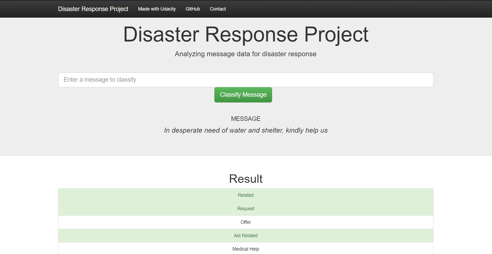
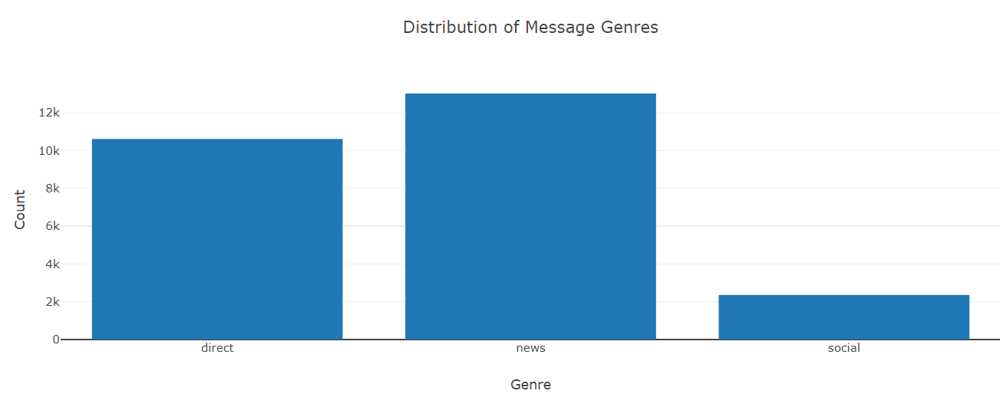
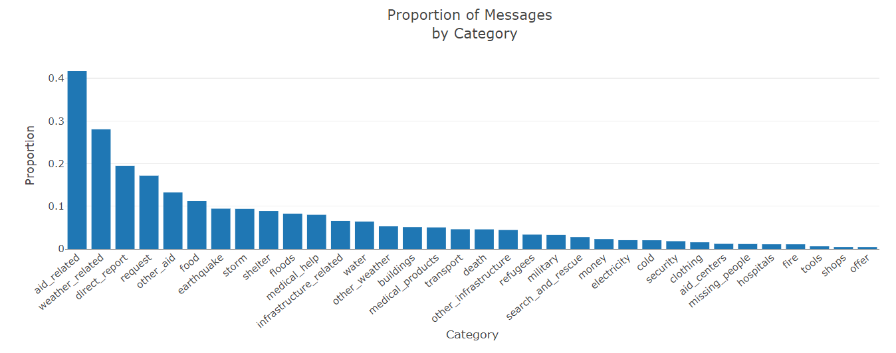
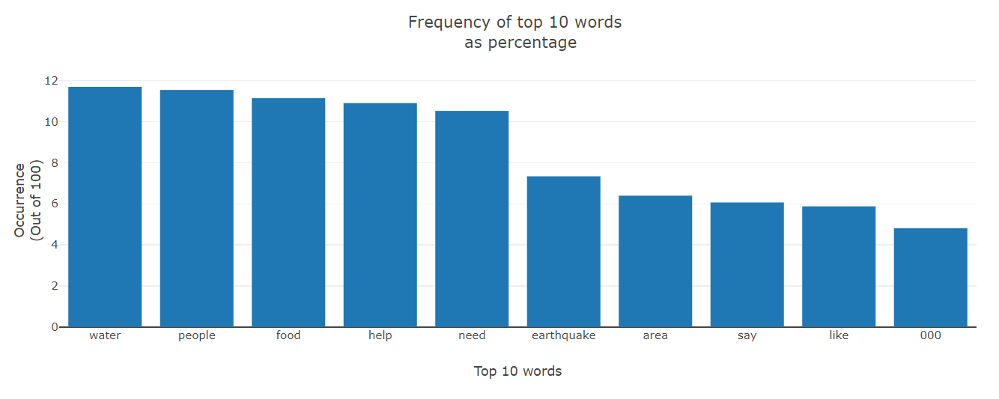

# Disaster Response

### Table of Contents

- [Project Motivation](#motivation)
- [Project Components](#components)
  - [ETL Pipeline](#etl_pipeline)
  - [ML Pipeline](#ml_pipeline)
  - [Flask Web App](#flask)
- [Screenshots](#screenshots) 
- [Contribute](#contribute)

***

<a id='motivation'></a>

## 1. Project Motivation

The power of data to tell a compelling story has always fascinated me. Sometimes, though, I end up feeling dejected and downcast when events like [this](https://ourworldindata.org/natural-disasters) catch my attention. How much prosperous our world would be if something was to be done about deaths from natural disasters?! And this is exactly what I ventured to find out with the power of Machine Learning...

<a id='components'></a>

## 2. Project Components

There are three components in this project:

<a id='etl_pipeline'></a>

### 2.1. ETL Pipeline

File `process_data.py` contains data cleaning pipeline that:

- Loads the files `disaster_messages.csv` and `disaster_categories.csv`
- Merges the two datasets after cleaning them
- Stores it in a SQLite database
<br>
To execute this file, type the following in the terminal:<br>

```python process_data.py disaster_messages.csv disaster_categories.csv database.db```

<a id='ml_pipeline'></a>

### 2.2. ML Pipeline

File _models/train_classifier.py_ contains machine learning pipeline that:

- Loads data from the SQLite database
- Builds a text processing and machine learning pipeline
- Trains and tunes the model
- Exports the final model as a pickle file
<br>
To execute this file, type the following in the terminal:<br>

```python train_classifier.py ../data/database.db model_svc.pkl```

### 2.3. Flask Web App

The micro web framework Flask is used to provide connectivity between the web page and the Python code
To run the web app, type the following in the terminal:<br>

`python run.py`

***

<a name="screenshots"/>

## Screenshots






***


<a name="contribute"/>

## Contribute
1.  Fork the repository from Github
2.  Clone your fork

`git clone https://github.com/kaustubh-ai/Disaster-Response.git`

3.  Add the main repository as a remote

`git remote add upstream https://github.com/kaustubh-ai/Disaster-Response.git`

4.  Create a pull request!
